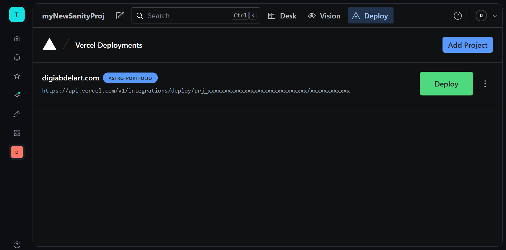

## How it works

DigiAbdel Art is built with Static Site Generation rather than Server-Side Rendering — a deliberate architectural decision. With SSR, the server would rebuild and serve each page on every visitor request, which adds cost and latency at scale. With SSG, all pages are built once into plain HTML and served instantly from Vercel's edge network, making the site fast and essentially free to run regardless of traffic.
The content is managed through Sanity Studio. Whenever the artist wants to add or update a piece, he does it through the Sanity dashboard. Rather than triggering an automatic rebuild on every save, a custom Deploy tab was integrated directly into the Sanity Studio interface — it uses Vercel's deploy hook URL to kick off a new build on demand. The site only rebuilds when the artist explicitly chooses to publish changes, keeping the process intentional and controlled. Every visitor then gets the exact same pre-built pages until the next deploy.

## Technical highlights

### Custom Image Layout Grid

Sanity has no native way to control how images are sized within a gallery, so a custom solution was designed around a six-column grid. Each image occupies exactly one column, but its height is set by a value the artist picks per image from a dropdown in Sanity Studio — 2/6 for one third, 4/6 for two thirds, 6/6 for the full height. On the frontend, that value flows directly from the CMS into a CSS custom property and is applied to the grid via Tailwind's arbitrary value syntax, keeping the layout entirely data-driven with no hardcoded styles per image.
